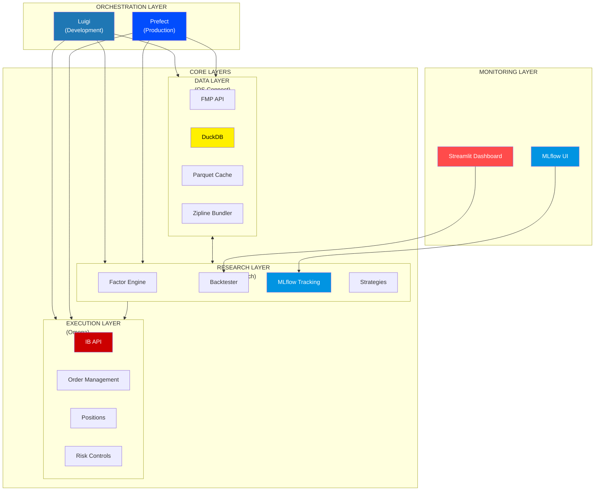
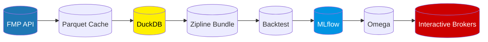

# Quant Hedge Fund System

<p align="center">
 
 
 
 
 
 
</p>

<p align="center">
 <strong>A complete Python-powered algorithmic trading system for building and running your own quant hedge fund</strong>
</p>


https://github.com/user-attachments/assets/0a2bbe6c-188f-41e2-9080-8c016b3c9743


---

## Table of Contents

- [Overview](#overview)
- [Architecture](#architecture)
- [Features](#features)
- [Project Structure](#project-structure)
- [Quick Start](#quick-start)
- [Configuration](#configuration)
- [Components Deep Dive](#components-deep-dive)
- [Running the System](#running-the-system)
- [Strategy Development](#strategy-development)
- [API Reference](#api-reference)
- [Troubleshooting](#troubleshooting)
- [License & Disclaimer](#license--disclaimer)

---

## Overview

The **Quant Hedge Fund System** is a comprehensive, end-to-end algorithmic trading platform that automates the entire investment process:

1. **Data Collection** - Download and store 25+ years of market data and fundamentals
2. **Research & Backtesting** - Test trading strategies with professional-grade analytics
3. **Experiment Tracking** - Log all experiments with MLflow for reproducibility
4. **Automated Execution** - Execute trades automatically via Interactive Brokers
5. **Real-time Monitoring** - Track performance with a live dashboard

This system is based on the **Quant Science** production architecture, designed to bring institutional-quality tools to individual investors and traders.

### Who Is This For?

- **Python developers** interested in algorithmic trading
- **Quantitative analysts** looking for a complete research framework
- **Retail traders** who want to systematize their investment process
- **Data scientists** exploring financial applications of ML

### What Makes This Different?

Unlike simple trading bots, this is a **full quant infrastructure**:

| Feature | Simple Bot | This System |
|---------|------------|-------------|
| Data Management | CSV files | DuckDB columnar database with billions of rows |
| Backtesting | Single strategy | Multi-factor with parameter sweeps |
| Tracking | None | MLflow with 88+ metrics per run |
| Automation | Manual | Luigi + Prefect orchestration |
| Execution | Basic orders | Portfolio rebalancing with risk controls |

### Why This Matters in 2025

The financial markets in 2025 demand a new level of sophistication:

- **AI-Driven Markets** - Institutional players now use advanced ML models. This system levels the playing field with XGBoost integration and MLflow experiment tracking.

- **High-Frequency Data** - Markets move faster than ever. DuckDB handles 900M+ rows efficiently, enabling analysis that would crash traditional tools.

- **Volatility & Uncertainty** - Factor-based strategies like QSMOM have historically outperformed during volatile periods by capturing momentum while avoiding short-term noise.

- **Regulatory Complexity** - Full audit trails via MLflow ensure every backtest is reproducible and documented.

- **Cost Efficiency** - No expensive Bloomberg terminals or proprietary platforms. This is 100% open-source Python running on your own infrastructure.

**Key 2025 Market Advantages:**

| Challenge | How This System Helps |
|-----------|----------------------|
| Rising interest rates | Factor backtesting across multiple rate regimes (2015-2025) |
| AI/Tech sector rotations | Universe screening filters 500+ stocks by liquidity and sector |
| Increased retail participation | Automated rebalancing removes emotional decision-making |
| Geopolitical risk | Risk controls and position limits protect against drawdowns |
| Information overload | Streamlit dashboard surfaces only actionable signals |

---

## Architecture

The system follows a **layered architecture** with clear separation of concerns:



### Data Flow



1. **FMP API**: Financial Modeling Prep provides market and fundamental data
2. **Parquet Cache**: Raw API responses cached as compressed columnar files
3. **DuckDB**: High-performance analytical database for fast queries
4. **Zipline Bundle**: Data formatted for the Zipline backtesting engine
5. **Backtest**: Strategy executed historically with realistic simulation
6. **MLflow**: Results logged with full configuration reproducibility
7. **Omega**: Winning strategy positions converted to orders
8. **Interactive Brokers**: Orders executed in the live market

---

## Features

### Data Layer (QS Connect)

| Feature | Description |
|---------|-------------|
| **Bulk Price Download** | Download historical OHLCV data for thousands of symbols |
| **Fundamental Data** | Income statements, balance sheets, cash flows, ratios |
| **DuckDB Storage** | Columnar database handling 900M+ rows efficiently |
| **Parquet Caching** | Delta detection to avoid re-downloading data |
| **Zipline Bundler** | One-line command to create Zipline data bundles |
| **Rate Limiting** | Automatic API rate limiting with retries |

#### Real-Time Layer (TIP-Search)
| Feature | Description |
|---------|-------------|
| **Latency Profiling** | Offline profiling of model inference times (P99 latency) |
| **Deadline Awareness** | Filters models that cannot meet the strict nanosecond deadline |
| **Accuracy Maximization** | Selects the most accurate valid model dynamically |
| **O(K) Scheduling** | Constant-time decision making for low-latency loops |
| **Performance** | Benchmarked scheduler overhead of **~84µs** (0.08ms) per decision |
| **Task Abstraction** | Unified `InferenceTask` interface for all market events |

### Research Layer (QS Research)

| Feature | Description |
|---------|-------------|
| **Factor Engine** | Momentum, value, quality factor calculations |
| **Preprocessing** | Universe screening, outlier removal, data cleaning |
| **Backtest Runner** | Run strategies with configurable parameters |
| **Parameter Sweeps** | Test 100s of parameter combinations automatically |
| **MLflow Integration** | Log 88+ metrics for every backtest run |
| **Tear Sheets** | Professional reports for returns, factors, transactions |
| **XGBoost Integration** | Machine learning enhanced factor strategies |
| **LLM Strategy Generator** | AI-powered regime analysis and parameter tuning via Groq |

### Execution Layer (Omega)

| Feature | Description |
|---------|-------------|
| **IB Connection** | Connect to Interactive Brokers Gateway |
| **order_target_percent()** | Rebalance to target portfolio weights |
| **Position Tracking** | Monitor current holdings |
| **Order Management** | Submit, modify, cancel orders |
| **Zipline Converter** | Convert backtest outputs to live orders |

### Orchestration Layer

| Feature | Description |
|---------|-------------|
| **Luigi DAGs** | Lightweight task orchestration for development |
| **Prefect Flows** | Production-grade nightly automation |
| **Dependency Graphs** | Tasks execute in correct order |
| **Retry Logic** | Automatic retry on failures |
| **Resource Locking** | Prevent concurrent database writes |

### Dashboard

| Feature | Description |
|---------|-------------|
| **Live Ops** | Real-time performance metrics and charts |
| **Research Lab** | Explore symbols and factor rankings |
| **Signal Charts** | Technical analysis with indicators |
| **AI Quant Team** | Chat interface for research assistance |

---

## Project Structure

```
QuantHedgeFund/
│
├── config/                # Configuration and settings
│   ├── __init__.py        # Module exports
│   ├── settings.py        # Pydantic settings management
│   ├── constants.py       # Enums and default parameters
│   └── logging_config.py  # Loguru logging setup
│
├── qsconnect/             # DATA LAYER
│   ├── __init__.py        # Main Client import
│   ├── client.py          # Primary data interface
│   ├── api/
│   │   ├── base_client.py # Rate-limited HTTP client
│   │   └── fmp_client.py  # FMP API implementation
│   ├── database/
│   │   └── duckdb_manager.py # Database operations
│   ├── cache/
│   │   └── cache_manager.py  # Parquet caching
│   ├── bundle/
│   │   └── zipline_bundler.py # Zipline bundle creation
│   └── utils/
│       └── paths.py       # Path utilities
│
├── qsresearch/            # RESEARCH LAYER
│   ├── __init__.py
│   ├── features/
│   │   ├── momentum.py    # QSMOM factor
│   │   ├── forward_returns.py # ML target creation
│   │   ├── factor_engine.py   # Factor computation engine
│   │   └── technical_indicators.py # pandas-ta integration
│   ├── preprocessors/
│   │   ├── price_preprocessor.py # Data cleaning
│   │   └── universe_screener.py  # Stock filtering
│   ├── realtime/          # REAL-TIME LAYER (TIP-Search)
│   │   ├── scheduler.py   # O(K) Inference Scheduler
│   │   ├── tasks.py       # Real-time Task definitions
│   │   └── models.py      # Latency-aware Model wrappers
│   ├── backtest/
│   │   ├── run_backtest.py # Main backtest runner
│   │   ├── parameter_sweep.py # Iterative sweeps
│   │   └── strategy_artifacts.py # Manifest generation
│   ├── portfolio_analysis/
│   │   ├── performance_metrics.py # 88+ metrics
│   │   └── tear_sheets.py # HTML reports
│   └── strategies/
│       └── factor/
│           ├── algorithms.py # Signal generation
│           └── config.py     # Strategy configs
│
├── omega/                 # EXECUTION LAYER
│   ├── __init__.py
│   ├── trading_app.py     # IB trading interface
│   └── utils/
│       └── omega_trades_converter.py
│
├── workflow/              # LUIGI ORCHESTRATION
│   ├── dags/
│   │   └── 01_ingest_data.py # Complete DAG
│   └── luigi.cfg          # Luigi configuration
│
├── automation/            # PREFECT ORCHESTRATION
│   ├── prefect_flows.py   # Production flows
│   └── deployment_manager.py # Model promotion
│
├── dashboard/             # STREAMLIT UI
│   └── app.py             # Main dashboard
│
├── scripts/               # UTILITIES
│   ├── setup_database.py       # Initialize DB
│   ├── download_initial_data.py # First data download
│   ├── start_dashboard.py      # Launch dashboard
│   └── simulate_realtime_inference.py # TIP-Search simulation
│
├── .env.example           # Environment template
├── .gitignore             # Git ignore rules
 requirements.txt # Python dependencies
 pyproject.toml # Project metadata
 README.md # This file
 docs/
 DOCUMENTATION.md # Detailed documentation
```

---

## Quick Start

### Prerequisites

- **Python 3.10+** (3.11 or 3.12 recommended)
- **FMP API Key** (free tier available at [financialmodelingprep.com](https://financialmodelingprep.com))
- **Interactive Brokers** account (optional, for live trading)
- **8GB+ RAM** recommended for large datasets

### Step 1: Clone and Setup

```bash
# Clone the repository
git clone https://github.com/your-username/QuantHedgeFund.git
cd QuantHedgeFund

# Create virtual environment
python -m venv venv

# Activate (Windows)
venv\Scripts\activate

# Activate (macOS/Linux)
source venv/bin/activate

# Install dependencies
pip install -r requirements.txt
```

### Step 2: Configure Environment

```bash
# Copy environment template
cp .env.example .env

# Edit .env and add your API keys
# Required: FMP_API_KEY
# Optional: OPENAI_API_KEY (for AI features)
```

Example `.env` file:
```env
# API Keys
FMP_API_KEY=your_fmp_api_key_here

# Database
DUCKDB_PATH=data/quantdb.duckdb

# MLflow
MLFLOW_TRACKING_URI=http://127.0.0.1:5050
MLFLOW_EXPERIMENT_NAME=Momentum Factor Strategy
```

### Step 3: Initialize Database

```bash
python scripts/setup_database.py
```

This creates:
- DuckDB database with schema
- Required directories (data/, logs/, cache/)

### Step 4: Download Data

```bash
python scripts/download_initial_data.py
```

This downloads:
- Historical price data (2015-present)
- Fundamental data (optional, takes longer)
- Creates Zipline bundle

### Step 5: Run Dashboard

```bash
streamlit run dashboard/app.py
```

Open `http://localhost:8501` in your browser.

### Step 6: Start MLflow (Optional)

```bash
mlflow server --port 5050
```

Open `http://localhost:5050` to view experiments.

---

## Configuration

### Environment Variables

| Variable | Description | Required |
|----------|-------------|----------|
| `FMP_API_KEY` | Financial Modeling Prep API key | |
| `DATALINK_API_KEY` | Datalink API key (alternative data) | |
| `OPENAI_API_KEY` | OpenAI API for AI Quant Team | |
| `DUCKDB_PATH` | Path to DuckDB database file | |
| `CACHE_DIR` | Directory for parquet cache | |
| `LOG_DIR` | Directory for log files | |
| `MLFLOW_TRACKING_URI` | MLflow server URL | |
| `MLFLOW_EXPERIMENT_NAME` | Default experiment name | |
| `IB_HOST` | Interactive Brokers Gateway host | |
| `IB_PORT` | IB Gateway port (7497 paper, 7496 live) | |
| `IB_CLIENT_ID` | IB client identifier | |

### Strategy Configuration

Strategies are configured via Python dictionaries. See `qsresearch/strategies/factor/config.py`:

```python
MOMENTUM_FACTOR_CONFIG = {
 # MLflow settings
 "experiment_name": "Momentum Factor Strategy",
 "run_name": "qsmom_equal_weight_long_only",
 
 # Backtest parameters
 "bundle_name": "historical_prices_fmp",
 "start_date": "2015-01-01",
 "end_date": "2025-02-14",
 "capital_base": 1_000_000,
 
 # Preprocessing pipeline
 "preprocessing": [
 {
 "name": "price_preprocessor",
 "params": {"min_trading_days": 504}
 },
 {
 "name": "universe_screener",
 "params": {"volume_top_n": 500}
 },
 ],
 
 # Factor calculation
 "factors": [
 {
 "name": "momentum_factor",
 "params": {
 "fast_period": 21, # 1 month
 "slow_period": 252, # 1 year
 "signal_period": 126, # 6 months
 }
 },
 ],
 
 # Algorithm
 "algorithm": {
 "callable": "use_factor_as_signal",
 "params": {"top_n": 20}
 },
 
 # Portfolio construction
 "portfolio_strategy": {
 "func": "long_short_equal_weight_portfolio",
 "params": {
 "num_long_positions": 20,
 "num_short_positions": 0, # Long only
 }
 },
}
```

---

## Components Deep Dive

### QS Connect (Data Layer)

QS Connect is your single source of truth for all market data. It handles:

**Connecting to APIs:**
```python
from qsconnect import Client

client = Client() # Uses environment variables

# Or pass keys directly
client = Client(fmp_api_key="your_key")
```

**Downloading Price Data:**
```python
# Download bulk historical prices
prices = client.bulk_historical_prices(
 start_date=date(2015, 1, 1),
 end_date=date.today(),
)

# Data is automatically cached to parquet and stored in DuckDB
print(f"Downloaded {len(prices)} records")
```

**Downloading Fundamental Data:**
```python
# Download income statements, balance sheets, etc.
client.fetch_bulk_financial_statements(
 statement_type=[
 "income-statement",
 "balance-sheet-statement",
 "cash-flow-statement",
 "ratios"
 ],
 periods="all", # annual + quarterly
 start_year=2000,
 end_year=2025,
)
```

**Querying the Database:**
```python
# Direct SQL queries
df = client.query("""
 SELECT symbol, date, close, volume
 FROM prices
 WHERE symbol = 'AAPL'
 AND date >= '2024-01-01'
 ORDER BY date
""")
```

**Building Zipline Bundles:**
```python
# Create a bundle for backtesting
client.build_zipline_bundle("historical_prices_fmp")
client.register_bundle("historical_prices_fmp")
client.ingest_bundle("historical_prices_fmp")
```

### QS Research (Research Layer)

QS Research provides the framework for developing and testing strategies.

**Running a Backtest:**
```python
from qsresearch.backtest import run_backtest
from qsresearch.strategies.factor.config import MOMENTUM_FACTOR_CONFIG

# Run backtest with full MLflow logging
results = run_backtest(
 config=MOMENTUM_FACTOR_CONFIG,
 log_to_mlflow=True
)

# Access metrics
print(f"Total Return: {results['metrics']['portfolio_total_return']:.2%}")
print(f"Sharpe Ratio: {results['metrics']['portfolio_daily_sharpe']:.2f}")
print(f"Max Drawdown: {results['metrics']['portfolio_max_drawdown']:.2%}")
```

**Calculating Factors:**
```python
from qsresearch.features.momentum import add_qsmom_features

# Add momentum factor to price data
df_with_factors = add_qsmom_features(
 prices_df,
 fast_period=21,
 slow_period=252,
 signal_period=126
)

# The factor column is named: close_qsmom_21_252_126
```

**Running Parameter Sweeps:**
```python
from qsresearch.backtest.parameter_sweep import run_iterative_sweep

sweep_config = {
 "param_grid": {
 "fast_period": [21, 42, 63],
 "slow_period": [126, 252, 504],
 "top_n": [10, 20, 30],
 }
}

results = run_iterative_sweep(
 sweep_config=sweep_config,
 experiment_name="Momentum_Factor_Iterative_Sweep"
)

# Find best combination
best = max(results, key=lambda x: x["sharpe_ratio"])
print(f"Best params: {best['params']}")
```

### Omega (Execution Layer)

Omega connects your strategies to interactive Brokers.

**Connecting:**
```python
from omega import TradingApp

app = TradingApp(paper_trading=True) # Use paper account
```

**Checking Positions:**
```python
positions = app.get_positions()
for pos in positions:
 print(f"{pos['symbol']}: {pos['quantity']} shares @ ${pos['avg_cost']:.2f}")
```

**Rebalancing Portfolio:**
```python
# The key method: order_target_percent
# This calculates exact shares needed to reach target allocation

app.order_target_percent("AAPL", 0.05) # 5% in Apple
app.order_target_percent("MSFT", 0.05) # 5% in Microsoft
app.order_target_percent("GOOGL", 0.05) # 5% in Google

# To exit a position completely
app.liquidate_position("TSLA")
```

**Converting Backtest to Orders:**
```python
from omega.utils.omega_trades_converter import omega_trades_from_zipline

# Get current positions from broker
current = app.get_positions()

# Get target positions from backtest
target = backtest_results["positions"]

# Calculate required trades
orders = omega_trades_from_zipline(current, target)

# Execute
for order in orders:
 app.submit_order(order)
```

---

## Running the System

### Development: Luigi Workflow

Luigi is ideal for development and one-off runs:

```bash
# Start Luigi scheduler (optional, for web UI)
luigid --port 8082

# Run the full pipeline
python -m workflow.dags.01_ingest_data ExecuteTrades \
 --start-date 2015-01-01 \
 --run-date 2025-12-30 \
 --local-scheduler
```

The Luigi DAG executes in order:
1. `DownloadPricesFMP` - Download historical prices
2. `DownloadFundamentalsFMP` - Download financial statements
3. `BuildZiplineBundle` - Create backtest data bundle
4. `RunBacktest` - Execute strategy backtest
5. `ExecuteTrades` - Place orders with broker

### Production: Prefect Automation

Prefect handles production scheduling:

```bash
# Start Prefect server
prefect server start

# Deploy flows
python automation/prefect_flows.py

# View at http://localhost:4200
```

Deployed flows:
- `nightly-pipeline-orchestrator` - Master flow (1 AM Tue-Sat)
- `nightly-qsconnect-refresh` - Database update (10 PM daily)
- `nightly-backtest` - Production backtest (2 AM daily)
- `nightly-iterative-sweep` - Parameter optimization
- `nightly-dashboard-snapshot` - Update dashboard data

---

## Strategy Development

### The QSMOM Factor

The core strategy uses a **momentum factor** calculated as:

```
QSMOM = ROC(slow_period) - ROC(fast_period)
```

Where:
- `ROC` = Rate of Change (percent return)
- `slow_period` = 252 days (1 year)
- `fast_period` = 21 days (1 month)

**Why this works:**
- Long-term momentum (252 days) captures trend persistence
- Subtracting short-term momentum avoids recent price spikes
- Stocks in the top quintile by QSMOM historically outperform

### Portfolio Construction

The strategy constructs a **long-only equal-weight portfolio**:

1. **Screen Universe**: Filter to top 500 stocks by volume
2. **Calculate Factor**: Compute QSMOM for each stock
3. **Rank Stocks**: Sort by factor value (descending)
4. **Select Top N**: Take top 20 stocks
5. **Equal Weight**: Allocate 5% to each position
6. **Rebalance Monthly**: Update positions at month end

### Creating Your Own Strategy

1. **Copy the template:**
```python
# In qsresearch/strategies/factor/config.py
MY_STRATEGY_CONFIG = MOMENTUM_FACTOR_CONFIG.copy()
MY_STRATEGY_CONFIG["experiment_name"] = "My Custom Strategy"
```

2. **Modify parameters:**
```python
MY_STRATEGY_CONFIG["factors"] = [
 {
 "name": "momentum_factor",
 "params": {
 "fast_period": 42, # 2 months
 "slow_period": 126, # 6 months
 }
 }
]
```

3. **Run backtest:**
```python
from qsresearch.backtest import run_backtest
results = run_backtest(MY_STRATEGY_CONFIG)
```

4. **Compare in MLflow:**
 - Open `http://localhost:5050`
 - View all runs side-by-side
 - Select best by Sharpe ratio

---

## API Reference

### QS Connect Client

```python
class Client:
 def stock_list(asset_type="stock", exchanges=None, min_price=5.0) -> pd.DataFrame
 def bulk_historical_prices(start_date, end_date, symbols=None, use_cache=True) -> pl.DataFrame
 def fetch_bulk_financial_statements(statement_type, periods, start_year, end_year) -> Dict
 def query(sql: str) -> pl.DataFrame
 def build_zipline_bundle(bundle_name, start_date=None, end_date=None) -> None
 def register_bundle(bundle_name) -> None
 def ingest_bundle(bundle_name) -> None
```

### QS Research

```python
def run_backtest(config: Dict, output_dir=None, log_to_mlflow=True) -> Dict
def run_iterative_sweep(sweep_config: Dict, run_date=None, experiment_name=None) -> List
def add_qsmom_features(df, fast_period=21, slow_period=252, signal_period=126) -> pd.DataFrame
def calculate_all_metrics(performance: pd.DataFrame, benchmark=None) -> Dict[str, float]
```

### Omega Trading App

```python
class TradingApp:
 def connect() -> bool
 def disconnect() -> None
 def get_positions() -> List[Dict]
 def get_account_info() -> Dict
 def get_portfolio_value() -> float
 def order_target_percent(symbol, target_percent, order_type="MKT") -> Trade
 def liquidate_position(symbol) -> Trade
 def get_open_orders() -> List[Dict]
 def cancel_all_orders() -> int
```

---

## LLM Strategy Generator

The system includes an **AI-powered research assistant** (`qsresearch/llm/`) that uses Groq's `openai/gpt-oss-20b` model to:

- **Analyze Market Regimes**: Calculate volatility, trend strength, and returns to classify the market (Bull Steady, Bull Volatile, Bear, Sideways).
- **Generate Strategy Parameters**: Prompt the LLM for optimal factor weights and lookback periods based on the current regime.
- **Multi-Candidate Search**: Generate N distinct strategy variations (Balanced, Aggressive, Defensive) and rank them.
- **Validation**: All LLM outputs are validated against strict constraints before use.

```python
from qsresearch.llm import StrategyGenerator

generator = StrategyGenerator()
candidates = generator.generate_candidates(prices, n=3)

# Each candidate is validated and ready for backtesting
for c in candidates:
    print(c['style'], c['factor_weights'])
```

> ⚠️ **Important**: The LLM is used **offline** for research and parameter tuning—NOT in the low-latency execution path.

---

## Pre-Live Checklist

Before enabling live trading, complete the mandatory safety checks in `docs/PRE_LIVE_CHECKLIST.md`:

1.  **Paper Trading**: Full day validation of order lifecycle.
2.  **Latency Benchmarking**: P50/P95/P99 for all execution hops.
3.  **Risk-Trigger Testing**: Verify loss limits and kill switches.
4.  **Failure-Mode Testing**: Simulate disconnects, stale data, and rejects.

> ⚠️ Skipping these steps means accepting **undefined behavior with real money**.

---

## Troubleshooting

### Common Issues

**Issue: FMP API rate limit exceeded**
```
Solution: The client automatically rate-limits to 300 req/min.
If you still hit limits, increase api_buffer_seconds in config.
```

**Issue: DuckDB file locked**
```
Solution: Only one process can write to DuckDB at a time.
Check for running Python processes or increase retry delay.
```

**Issue: Zipline bundle not found**
```
Solution: Run the bundle build steps:
 client.build_zipline_bundle("historical_prices_fmp")
 client.register_bundle("historical_prices_fmp")
 client.ingest_bundle("historical_prices_fmp")
```

**Issue: Interactive Brokers connection failed**
```
Solution: 
1. Ensure IB Gateway or TWS is running
2. Enable API connections in settings
3. Check port (7497 paper, 7496 live)
4. Verify client ID is unique
```

**Issue: MLflow tracking server not found**
```
Solution: Start the server with:
 mlflow server --port 5050
Or set MLFLOW_TRACKING_URI to a valid location.
```

---

## License & Disclaimer

### Disclaimer

**This software is for educational and informational purposes only.**

- This is NOT financial advice
- Past performance does NOT guarantee future results
- Use paper trading accounts for testing
- The authors are NOT responsible for any financial losses
- Always consult a qualified financial professional

### Risk Warning

Algorithmic trading involves substantial risk of loss. You could lose some or all of your investment. Do not trade with money you cannot afford to lose.

### License

Proprietary - All Rights Reserved

---


